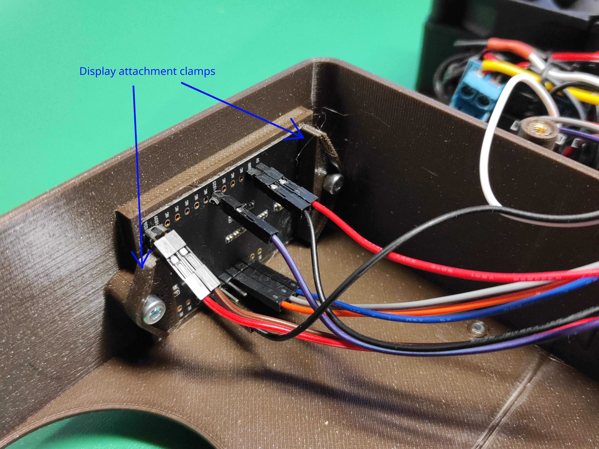

# 3d_printer_enclosure_heater

A PID controlled heater for 3d printer enclosures, providing stable and possibly elevated enclosure temperatures during printing.

* The heater uses 12V PCI-E power from a standard ATX power supply. If the power supply has had efficiency it provides extra heating - if it is inside the printer enclosure.
* The fans are always on, but the heating elements are PWM controlled at 4Hz based on a PID controller which mositors enclosure temperature.
* The temperature can be adjusted in 1°C increments with buttons.
* The heaters can be disable via a button, so only the fans are running.
* The display indicates current and set temperature and PWM output from 0 to 100%.

WARNING! This information is provided as-is and the author denies all liability for building or operating the described device. Only trained professionals should build the device. The device shall only be operated wile monitored by a skilled operator, never operate it unattended - there is the risk of fire, injury and death!

## Software

* The source code is locaded in `/src` and is compiled using platform.io.
* The setup is geared towards a Sparkfun `esp32things_plus` board but should work with any ESP32 - provided the pinout is adapted.
* The `main.cpp` contains all the configurable constants, most importantly the PID gains.
* The serial debugging function allows a bunch of additional things to be printer. What's enabled has been made compatible with this serial data monitor for realtime plotting: https://github.com/hacknus/serial-monitor-rust

## Hardware

* Hardware related files are under `/hardware`
* The FreeCAD file, as well as *.stl, *.3mf from Prusa Slicer as well as the *.gcode I used on my mini are in the `/hardware/3d_print_files` directory
* More photos are in `/hardware/photos`
* Pin assignments are defined in the `/src/main.cpp` file

### Parts

|count|item                                                                 |
|---|-----------------------------------------------------------------------|
|1  |THING PLUS ESP32 WROOM USB-C                                           |
|1  |SparkFun Environmental Sensor Breakout - BME680 (Qwiic)                |
|1  |T-BEAM OLED-1.3" display with 3 buttons                                |
|1  |12V to 5V buck converter                                               |
|3  |15A MOSFET PWM drivers                                                 |
|3  |12V 70W (in reality ~50W) heaters with fan                             |
|3  |KSD301 Normally Closed 10A overtemperature switches operating at 80°C  |
|12 |M4 Threaded Inserts                                                    |
|12 |M4x10mm screws                                                         |
|6  |M3 Threaded Inserts                                                    |
|6  |M3x8mm screws                                                          |
* Electrical wiring to connect all the compnents, including soldering equipment and skills
* A PCI-E cable and an ATX power supply able to provide ~200W at 12V
* 3D printer and material to produce the 3D printed parts

### Design description

* The fans, the DC-DC converter, the ESP32, the sensor and the display get continuous power.
* The ESP32 uses the BME680 sensor readings to determine temperature and by PID algorithms will regulate the pulse width of a PWM output.
* The 12V power for the heaters first passes thru the overtemperature switches. These switches would cut power at 80°C. In case a fan fails or similar deficiencies it will take some time, but then the overtemp switches will disable the heaters. This has been confirmed thru testing and thermal imaging was used for optimal placement of the thermal switches. However - never run the heater unattended!
* Then the voltage is fed to the three MOSFETs (one per heater) which are switching the heaters on and off at a rate of 4Hz (the lowest the ESP32 allows) and will modulate the on-time as dictated by the PWM output of the ESP32. This provides fine grained control over the amount of heat added to the chamber.
* When the device gets power the ESP32 will start up and the display will show the current temperature and the default set_point at startup. The PWM output will be disabled and the display will show 'OFF'.
* The operator can then adjust the temperature with the '+' and '-' buttons, and enable the heater with the center button.
* Now the diplay will show 'ON' and the heaters are getting the required amount of power to reach the desired temperature.
* During operation the target temperature can be changed, or the heaters disabled by again pusing the center button.

### Failure modes and mitigations - safety

* One of the MOSFETs could fail closed and permanently provide power to a heater, causing overheating.
    * Since the fans continuously get power, there should be no overheating of any sort. There would only be issues with incorrect temperatures.
* A fan could fail while the heater still gets power, leading to overheating of some sort.
    * The heaters are PTC resistive heater elements. With increasing temperature their resistance increases, which will reduce current and thus power of the heater. At some point radiation and convection and residual heater power reach equilibrium and further increases in temperature are stopped. Thermal imaging confirmed this to take the heater element to 200 to 250°C and the exterior of the heater case well beyond 100°C. While this may be no issue, there is still the risk that something could start melding and a fire could start.
    * Thermal imaging was used to determine the location on the exterior of the heater case where temperature rises first and where its the highest. In this location thermal switches were placed. They will see 80°C and disable power to the heater before the heating element reaches 200°C and should therefore prevent the worst.
    * However, the thernal switch will reset itself once the temperature as gone back down, and the heater with the failed fan would turn on again. Safety could be increased by using a single-use thermal fuse...
* A wire could cause a short circuit and wires could burn. And there are no fuses in the desing to prevent it.
    * On the PCI-E ATX power supply side, this is no different to any normal PC. The power supply should detect shorts and disable the output. Make sure to use wires equal or larger cross section than what comes from the power supply.
    * On the 5V side the DC-DC convertwer should be the limiting factor which would fail or disable power. Small fuses should be introduced to provide better safeguards against this failure.

## Why?

My shop is not heated and gets below 10°C during winter. This causes two problems:
* The Prusa mini will throw an error and reboot - preventing printing - whenever the nozzle or bed temperatures read below 10°C, because this trips some sofware monitors who flag the readings as 'outside a valid range'.
* Even PLA warps significantly at these ambient temperatures. This led me to build an enclosure, but because the enclosure temperature fluctuated depending on print activity and material, the results were still inconsistent.

The actively heated enclosure pre-warms the filament, provides a dry environment, stable temperatures with consistent results and elevated temperatures beyond 40°C which also makes printing ASA on the mini easy. I have yet to test PC and similar advanced materials.

## Notes

The Prusa mini is limited to 180mm (maybe 183 if you relally push it), which means I had to print the lid in two parts. This gave me the ugly sceam. Don't do that if you don't have to!